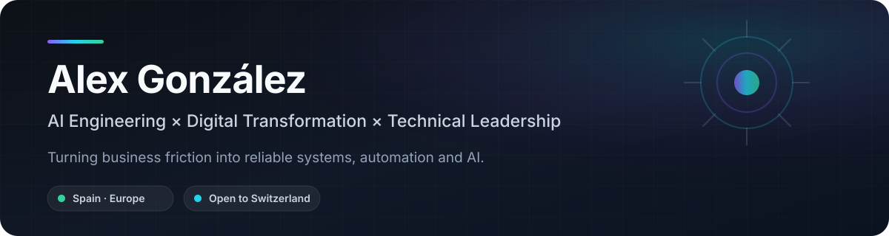

<p align="center">
  
</p>

<p align="center">
  <a href="https://www.linkedin.com/in/alex-gonz%C3%A1lez-jubany-0a6191170/">
    
  </a>
  
  
</p>

## I build technology around how businesses actually work

I'm a **Computer Engineer, IT Project Director and CIO** working at the intersection of **business operations, software engineering and applied AI**.

My strongest skill is not a specific framework. It's understanding a process end to end, finding where time, information or decision quality is being lost, and turning that friction into a better system.

Today I'm especially focused on **Agentic AI and enterprise AI systems** — not isolated demos, but AI that can interact reliably with real workflows, tools, data and application state.

> **Business problem first. Architecture second. Technology third.**

<table>
<tr>
<td width="33%" valign="top">

### 🧠 AI Systems

Agentic workflows  
LLM applications  
Tool use & integrations  
Durable state  
Evals & guardrails  
Human-in-the-loop

</td>
<td width="33%" valign="top">

### ⚙️ Transformation

ERP / Odoo  
Process redesign  
Workflow automation  
System integration  
Operational digitization  
Information flows

</td>
<td width="33%" valign="top">

### 🧭 Leadership

Technical direction  
Project execution  
Team coordination  
Vendors & budgets  
Technology purchasing  
Architecture decisions

</td>
</tr>
</table>

## Selected work

### 🧠 LifeOS — AI-native personal operating system

My current flagship engineering project is a **private system for coordinating tasks, learning and other life domains through structured state, automation and AI**.

The interesting part is not the personal productivity layer. It's the architecture underneath:

`agentic workflows` · `durable structured state` · `domain boundaries` · `deterministic adapters` · `schema validation` · `GitHub Actions` · `idempotency` · `optimistic concurrency` · `event logging`

A sanitized public architecture case study is being prepared. **No private source code or personal data will be published.**

### 🏢 Enterprise digital transformation — IOBOX SL

**IT Project Director / CIO · 2024 — Present**

Leading technology and digital transformation initiatives across the company, including:

- Odoo ERP migration, implementation and continuous evolution
- Business process analysis and redesign
- Software and systems integration
- Technical project direction
- Coordination of a team of up to **5 people**
- Technology vendors, budgets and purchasing decisions
- Infrastructure, maintenance and adoption of new technologies
- Increasing application of AI and automation to internal workflows

### ⚙️ Operational systems & process optimization — Conservas Dani

**2021 — 2024**

Worked across business operations to identify inefficient processes and implement technological improvements involving **fleet management, warehouses, ERP, internal systems and operational workflows**.

Earlier in my career, I worked on **IoT and software projects at The World of Thor**, developing and implementing solutions around real customer requirements.

---

## How I approach a problem

```text
Business friction
      ↓
Understand the real process
      ↓
Find bottlenecks, duplication and weak decisions
      ↓
Choose the right lever
      ├── Better process
      ├── Conventional software
      ├── Automation
      └── AI / agentic capability
      ↓
Integrate with the existing business
      ↓
Measure → learn → improve
```

I don't assume AI is always the answer. Some problems need an agent; others need a reliable API, a better data model, an ERP change or simply a better process.

That distinction matters.

## Current AI focus

I'm continuously developing my understanding of:

**Agentic AI · LLM applications · tool use · context & state management · evals · enterprise AI · AI-assisted development · human-AI collaboration · AI governance**

The questions I care about are increasingly practical:

- How should agents interact with business systems safely?
- What should remain deterministic?
- How do we evaluate and observe AI behavior?
- How do we preserve state and continuity without hiding critical logic inside a model?
- Where does AI create leverage rather than additional complexity?

## Technology

**AI & Automation**  
`Python` · `LLM integrations` · `Agentic systems` · `Workflow automation`

**Application Engineering**  
`TypeScript` · `JavaScript` · `Java` · `Spring` · `C#` · `.NET` · `REST APIs`

**Data & Infrastructure**  
`SQL` · `MongoDB` · `Docker` · `Cloudflare` · `GitHub Actions` · `CI/CD`

**Enterprise & Foundations**  
`Odoo` · `ERP` · `Systems integration` · `C` · `C++` · `IoT`

I treat the stack as a means to an outcome, not as a professional identity.

## Career snapshot

| Period | Role / Focus | Scope |
|---|---|---|
| **2024 — Present** | **IT Project Director / CIO · IOBOX SL** | Digital transformation, Odoo ERP, technical leadership, vendors, budgets, systems |
| **2021 — 2024** | **Business Process & IT Optimization · Conservas Dani** | Operations, fleet, warehouses, ERP, internal systems, process improvement |
| **Earlier** | **IoT & Software Development · The World of Thor** | Customer-focused IoT and software solutions |
| **Education** | **Computer Engineering — Management & Information Systems** | TecnoCampus Mataró |

## Beyond a job title

The roles I'm most interested in are those where **AI, engineering, business transformation and leadership converge**:

`AI Engineering` · `Applied AI` · `Agentic Systems` · `AI Transformation` · `Technical Leadership` · `Digital Transformation` · `Enterprise Automation`

**Spain / Europe · Particularly interested in Switzerland · Remote, hybrid or on-site**

**Languages:** Spanish 🇪🇸 native · Catalan native · English 🇬🇧 upper-intermediate · French 🇫🇷 basic

<details>
<summary><b>🇪🇸 Resumen en español</b></summary>

<br>

Soy **Ingeniero Informático, Director de Proyectos Informáticos y CIO**. Mi perfil combina desarrollo de software, sistemas empresariales, ERP/Odoo, optimización de procesos, digitalización, gestión de proyectos y liderazgo tecnológico.

Actualmente estoy especialmente centrado en **IA aplicada y sistemas agénticos**: cómo integrar agentes, LLMs, herramientas y estado estructurado dentro de sistemas reales de empresa de forma útil, observable y fiable.

Mi especialidad es entender cómo funciona un proceso, detectar dónde se pierde tiempo o información y diseñar una solución adecuada. A veces esa solución es IA; otras veces es software convencional, automatización, integración o rediseño del proceso.

</details>

---

<p align="center">
  <b>Business × Engineering × AI</b><br/>
  <sub>Build reliable systems. Improve processes. Create leverage.</sub>
</p>
